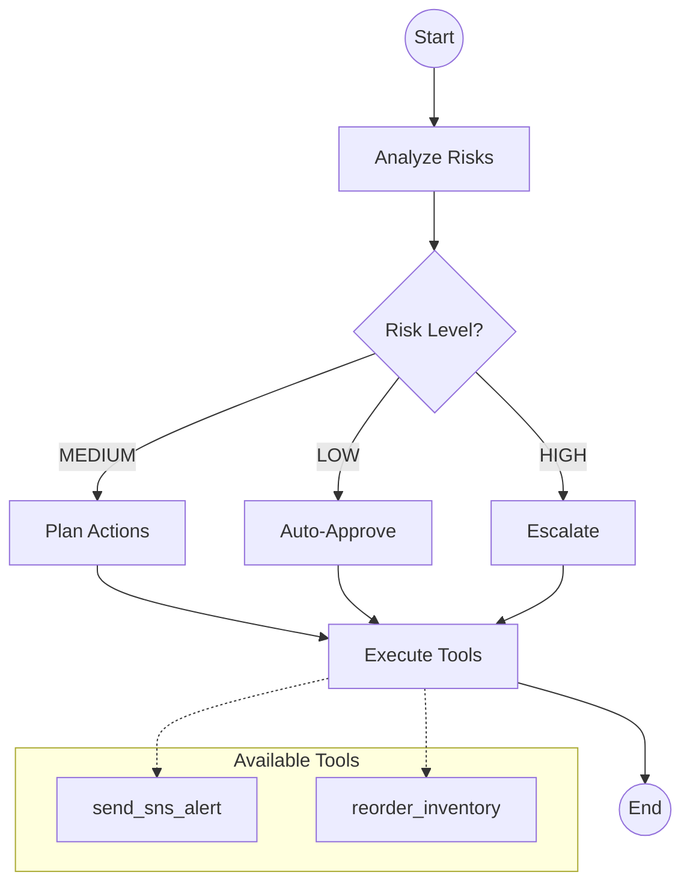

# Retail Ops Agent

**A production-ready, agentic AI system built on AWS Lambda and Amazon Bedrock.**

This project implements a fully autonomous AI agent designed to streamline retail operations. It analyzes sales and inventory data, plans strategic actions, and executes business decisions (like reordering inventory or escalating risks) using a robust **Analyze → Plan → Act** flow.

---

## Key Features

- **Agentic Logic with LangGraph**: State-of-the-art multi-node graph architecture for complex decision-making.
- **Dynamic Tooling Layer**: Automates real-world actions like **SNS Alerts** for high-risk escalations and **Inventory Reorders** for medium-risk stockouts.
- **Bedrock-Powered Reasoning**: Leverages Anthropic Claude models via Amazon Bedrock for intelligent risk analysis and action planning.
- **LangSmith Tracing**: Full observability into every decision path with custom metadata (SKU, Risk Level, Decision).
- **Proactive Risk Management**:
  - **HIGH**: Immediate escalation via SNS Notification.
  - **MEDIUM**: Strategic planning and optional automated reordering.
  - **LOW**: Safe, automated approvals for routine operations.
- **Production-Grade Infrastructure**: Deployed as a scalable AWS Lambda function with automated Linux-compatible packaging.

---

## Architecture

The agent follows a deterministic state machine built on LangGraph:



---

## Project Structure

- `app/main.py`: AWS Lambda handler and entry point.
- `app/agent/`: Core agent logic (graph, state, nodes, risk classification).
- `app/tools/`: Integration with external services (SNS, Inventory).
- `app/memory/`: Persistent storage using DynamoDB for SKU data and agent memory.
- `app/llm/`: Amazon Bedrock client configuration.
- `tests/integration/`: Comprehensive test suite for deterministic routing and tool execution.

---

## Getting Started

### 1. Requirements
- Python 3.12+
- AWS CLI configured with Bedrock/Lambda/DynamoDB permissions.

### 2. Installation
```bash
python3 -m venv .venv
source .venv/bin/activate
pip install -r requirements.txt
```

### 3. Running Tests
The project includes a robust suite of integration tests that mock the LLM for deterministic verification:
```bash
pytest tests/integration/
```

### 4. Deployment
Use the included packaging script to prepare the Lambda ZIP:
```bash
./package_lambda.sh
```

---

## Monitoring & Observability
This project is integrated with **LangSmith** for real-time tracing. Every invocation captures:
- **Input/Output** of every graph node.
- **Tool calls** and their results.
- **Metadata** for deep-dive analysis (e.g., SKU-specific performance).

---

##  Evaluation
Evaluation is focused on **behavioral correctness**:
- Verify that HIGH-risk signals (e.g., "Supplier disruption") always trigger escalations.
- Ensure LOW-risk signals never invoke expensive tools.
- Validate that the agent correctly calculates reorder quantities based on reorder points.
